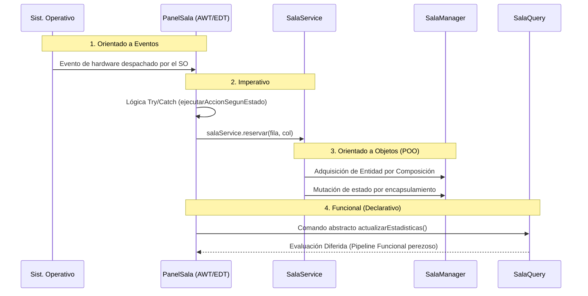

# Análisis Técnico Exhaustivo — Sistema de Gestión de Butacas de Cine

El presente documento disecciona el sistema capa por capa, siguiendo la arquitectura de dependencias (`model` → `exception` → `service` → `view` → `app`), aplicando los tres ejes solicitados a cada clase relevante de forma académica y objetiva.

---

## CAPA model/

### 1. EstadoButaca (enum)

**Análisis de clase, paradigma y mecánica interna:**
Un enum es el tipo de dato que define el dominio cerrado de estados posibles en este caso (`LIBRE`, `RESERVADO`, `OCUPADO`). Un `enum` en Java no es "solo una lista de constantes"; internamente el compilador genera una clase `final` que extiende implícitamente `java.lang.Enum<EstadoButaca>`. Cada constante es una instancia `singleton` estática de esa clase, creada una sola vez en la fase de carga de la clase (*classloading*). 

> [!TIP]
> **Paradigma POO Aplicado:**
> Esto es Programación Orientada a Objetos aplicada correctamente en su forma más disciplinada. Sustituye de forma segura el antipatrón de "banderas mágicas" (variables sueltas de tipo texto o entero), cerrando el conjunto de valores posibles a nivel de tipado fuerte. El compilador protege contra la creación de estados imposibles.

**Trazabilidad y el rol de la JVM:**
Cada instancia del enum es inmutable y compartida por referencia en toda la JVM.

> [!NOTE]
> **Concepto: JVM (Java Virtual Machine)**
> La JVM es el motor o entorno de ejecución que corre la aplicación. Es la encargada de administrar la memoria, cargar las clases y ejecutar las instrucciones. Cuando la JVM carga el archivo `EstadoButaca`, crea en su memoria las únicas instancias posibles y nunca crea más.

Cuando la propiedad `estado` de una `Butaca` cambia, la JVM no crea un nuevo objeto en la memoria; simplemente reasigna el puntero hacia una de esas constantes preexistentes. Esto hace que las comparaciones con `==` sean **seguras, eficientes y correctas**.

### 2. Butaca

**Desglose de paradigma, atributos y mecánica interna:**
La clase `Butaca` se comporta estructuralmente como un **Value Object** (Objeto de Valor) con identidad parcialmente inmutable. 

> [!NOTE]
> **Concepto: Value Object vs. Entidad**
> En Domain-Driven Design (DDD), un *Value Object* no tiene una identidad única, se define por sus atributos y es inmutable. En este caso, la `Butaca` actúa como un híbrido (una **Entidad**): posee una identidad inmutable (sus coordenadas) pero su estado muta con el tiempo.

| 🔧 Atributo | 🧬 Tipo | 🔒 Modificador | ⚖️ Mutabilidad | ⏳ Ciclo de vida |
|:---|:---|:---|:---|:---|
| `fila` | `int` | `private final` | 🟢 Inmutable | Fijado en construcción, vive mientras el objeto exista. |
| `columna` | `int` | `private final` | 🟢 Inmutable | Igual que `fila`. |
| `estado` | `EstadoButaca` | `private` | 🔴 Mutable | Cambia en cada operación de negocio. |

**Inmutabilidad vs. Mutabilidad:**
La **identidad** de la butaca (su posición en la matriz) es inmutable, mientras que su `estado` es mutable. Definir `fila` y `columna` como `final` reduce drásticamente la superficie de posibles errores: nadie puede alterar accidentalmente la posición después de la instanciación.

> [!WARNING]
> **Deuda Técnica Menor: Sobrecarga de Constructores**
> La clase presenta dos constructores sobrecargados. Actualmente no hacen delegación explícita (usando `this(fila, columna, EstadoButaca.LIBRE)`), lo que duplica ligeramente la lógica de inicialización.

**Mecánica de `setEstado` (Entidad Anémica):**
El método `setEstado` es un *setter* trivial. Esto refleja el patrón de **Entidad Anémica**: la clase modelo (`Butaca`) almacena el estado, pero la validación real de las reglas de negocio reside en `SalaService`. Esto respeta el Principio de Responsabilidad Única (SOLID).

---

## CAPA exception/

### 3. Las 4 Excepciones de Negocio

Cada clase representa la ruptura de una regla de negocio específica:
- 🚫 **`PosicionInvalidaException`**: Fuera de los límites de la sala.
- 🚫 **`AsientoOcupadoException`**: Intento de reserva en butaca ya vendida.
- 🚫 **`AsientoYaReservadoException`**: Intento de reserva en butaca ya apartada.
- 🚫 **`AsientoNoReservadoException`**: Intento de cancelación inválido.

**Diseño POO — Herencia y el debate Checked vs. Unchecked:**
Todas extienden de `RuntimeException` (excepciones *unchecked*). 

> [!TIP]
> **Concepto: Checked vs Unchecked**
> Las excepciones *unchecked* no obligan al compilador a exigir bloques `try/catch`. Esto es un *trade-off* consciente: evita el "infierno de las excepciones chequeadas" y mantiene los contratos de las interfaces limpios, delegando la responsabilidad de captura al equipo de Frontend.

**Trazabilidad del dato y "Stack Unwinding":**
El viaje y flujo de la excepción a lo largo de las capas es el siguiente:

> [!NOTE]
> **Concepto: Stack Unwinding (Desenrollado de la pila)**
> Es el proceso de emergencia que ejecuta la JVM cuando se lanza una excepción. La máquina destruye la ejecución del método actual y salta "hacia atrás" por la pila de llamadas abortando operaciones hasta encontrar un bloque `catch` que atrape el error.

1. `SalaService` detecta la violación y lanza la excepción.
2. La JVM hace **Stack Unwinding**, interrumpiendo el flujo.
3. La excepción viaja intacta hacia la capa de Vista (`PanelSala`).
4. Allí es "atrapada" por el bloque `catch` y mostrada en un `JOptionPane`.

---

## CAPA service/

### 4. SalaManager

**Patrón de Diseño Aplicado:** 
> [!IMPORTANT]
> **Singleton (Patrón Creacional)**
> Garantiza que exista una única instancia de la matriz de butacas en todo el sistema. Previene la desincronización de datos al centralizar el estado.

**El Singleton y Thread-Safety:**
```java
public static synchronized SalaManager getInstance() { ... }
```
> [!NOTE]
> **Concepto: Thread-safe (Seguridad de hilos)**
> Es la propiedad de un bloque de código para funcionar correctamente (sin corromper datos) cuando es ejecutado simultáneamente por múltiples hilos de procesamiento. El uso de `synchronized` bloquea la clase para evitar condiciones de carrera, garantizando que el `getInstance()` sea *thread-safe*.
> 
> *Riesgo:* Usar `synchronized` en la firma de todo el método genera una contención innecesaria de rendimiento. En sistemas concurrentes de alto volumen se recomienda usar el patrón "Bill Pugh Singleton".

**Paradigma Imperativo Puro: `inicializarSala()`**
Utiliza un doble bucle `for` anidado. Es el paradigma **Imperativo** en su forma pura: instrucciones secuenciales que mutan el estado de la matriz. Es sumamente veloz ($O(n \cdot m)$ por acceso directo) y es la herramienta correcta para inicializar estructuras con efectos secundarios (*side-effects*).

---

### 5. ISalaService (Interfaz)

**Patrón de Diseño Aplicado:** 
**Interface Segregation (Segregación de Interfaces — SOLID)**
Define *exclusivamente* las operaciones transaccionales de modificación (`reservar`, `cancelar`, `ocupar`). No contiene operaciones de consulta. El compilador garantiza a nivel de tipado estricto que un componente de interfaz gráfica que solo debe leer datos será físicamente incapaz de invocar un método destructivo como `reservar()`.

---

### 6. SalaService (Facade)

**Patrón de Diseño Aplicado:** 
**Facade (Fachada — Patrón Estructural)**
Actúa como la Fachada de toda la lógica de negocio. Oculta al cliente (la Vista) la complejidad algorítmica interna del acceso a la matriz y de la verificación de reglas.

**Flujo Paso a Paso y el patrón "Fail-Fast":**
Aplica el sub-patrón **Fail-Fast** con cláusulas de guarda en cascada:
1. `validarPosicion()`
2. `getButaca()`
3. `verificarEstadoParaReserva()`
4. `cambiarEstado()`

Cada paso preliminar actúa como un escudo protector: aborta el flujo y lanza una excepción interrumpiendo el hilo en el acto (*fail-fast*) antes de permitir que la mutación corrompa el sistema.

---

### 7. ISalaQuery (Interfaz)

**Interface Segregation (Segregación de Interfaces — CQRS Implícito)**
Mientras `ISalaService` expone métodos que mutan el estado, `ISalaQuery` define de forma exclusiva métodos de **sólo lectura**. Este diseño implementa de forma indirecta el principio del patrón arquitectónico **CQRS (Command Query Responsibility Segregation)**, acoplando a los lectores gráficos únicamente con contratos inofensivos de consulta.

---

### 8. SalaQuery (El corazón funcional)

**Paradigma Aplicado:**
Es la implementación real de las consultas de lectura y es donde reluce el **Paradigma Funcional / Declarativo**. Se apoya completamente en la API de *Streams* de Java.

> [!NOTE]
> **Concepto: Lazy Evaluation (Evaluación Perezosa)**
> En el paradigma funcional moderno de Java, operaciones intermedias como `.filter()` y `.flatMap()` no iteran ningún dato ni consumen ciclos de procesador hasta que no se invoca una operación terminal final (`.count()`). Esta detonación diferida es lo que permite al motor optimizar los flujos de datos complejos.

**Disección del Pipeline de Stream:**
```java
public long contarLibres() {
    return Arrays.stream(manager.getButacas())           // 1. Fuente perezosa de filas (Stream<Butaca[]>)
            .flatMap(Arrays::stream)                     // 2. Aplana las filas a un Stream unidimensional
            .filter(b -> b.getEstado() == EstadoButaca.LIBRE) // 3. Función pura inmutable sin side-effects
            .count();                                    // 4. Operación terminal
}
```

> [!WARNING]
> **El Peligro Estructural en `obtenerMatriz()`**
> El método `obtenerMatriz()` retorna la referencia en memoria real a la matriz bidimensional del sistema, exponiéndola por completo al Frontend. Esto arruina el blindaje del patrón Facade y abre una brecha arquitectónica a mutaciones descontroladas por parte de componentes externos (ej: `matriz[0][0] = null`). 
> *Solución:* Eliminar el método y exponer únicamente valores primitivos de dimensiones como `obtenerTotalFilas()`.

---

## CAPA view/ (Paradigma Orientado a Eventos)

### El Event Dispatch Thread (EDT)
> [!IMPORTANT]
> **Concepto: EDT (Event Dispatch Thread)**
> El EDT es un hilo especial, único y exclusivo responsable de dibujar componentes y despachar eventos gráficos (clics de mouse, pulsaciones de teclas) en aplicaciones de escritorio de Java (AWT/Swing). 
> Swing **no es thread-safe**; por ende, ningún método visual que altere la interfaz (como `setText`) debe invocarse desde un hilo ajeno al EDT. Hacerlo podría provocar corrupción en el motor de renderizado o bloqueos totales (deadlocks).

### 9. MainFrame (Composición Raíz y Mediador)
**Patrones de Diseño Aplicados:**
1. **Mediator:** Actúa como el centro neural de comunicaciones entre paneles mediante la inyección cruzada de *callbacks*, logrando que `PanelSala` no necesite referencias directas de `PanelControl`.
2. **Adapter:** Utiliza un `WindowAdapter` instanciado de forma anónima para sobrescribir únicamente la firma relevante, en lugar de arrastrar código inútil.
3. **Observer Funcional Híbrido:** Reutiliza `Runnable` (una interfaz funcional de hilos del JDK) como un mecanismo de diseño *Observer*, inyectando de forma concisa funciones lambdas (`setAlCambiarEstado(() -> {...})`).

### 10. PanelSala (Orquestador Visual)
**Patrón de Diseño Aplicado:**
- **Observer Clásico (AWT):** Mediante `ActionListener` inyectando lambdas (`e -> onButacaClick(...)`). Dado que el lenguaje Java exige que toda variable externa capturada en una expresión lambda sea *effectively final* (finales en la práctica), el sistema inyecta correctamente referencias independientes en los eventos de los botones a la hora del ciclo de instanciación.

**Riesgo Crítico: Estado Duplicado (Violación de Single Source of Truth)**
> [!WARNING]
> En la toma de decisiones de `ejecutarAccionSegunEstado`, la aplicación decide el camino de negocio consultando una copia local en el caché visual del botón (`boton.getEstado()`), **no** consultando la verdadera fuente de la información alojada en el backend (`SalaQuery`). 
> *Refactor Sugerido:* Toda lógica condicional de interfaz que desemboque en un comando destructivo, debe corroborarse siempre con `salaQuery.obtenerButaca(fila, col).getEstado()` garantizando el patrón "*Única Fuente de Verdad*".

### 11. BotonButaca
**Patrones de Diseño Aplicados:**
- **Template Method:** Al heredar de `JButton` y sobrescribir el núcleo lógico de `paintComponent(Graphics g)`, el marco de desarrollo de Swing cede el control exacto a este componente delegándole el dibujo en un paso preciso del ciclo (Inversión de Control).

El método gráfico actualiza el caché y posteriormente invoca a `repaint()`. Dicho comando no fuerza al monitor a dibujar la pantalla instantáneamente, sino que encola una petición de dibujo en el **EDT** para que lo agrupe y lo despache en el próximo ciclo óptimo de CPU (Asincronismo Gráfico).

### 12. DialogReserva (El Bucle de Eventos Anidado)
> [!TIP]
> **Secondary Event Loop (Bucle Anidado)**
> Cuando un cuadro de diálogo se construye con su parámetro `modal = true` y es lanzado a la pantalla con `setVisible(true)`, el EDT **no bloquea el hilo computacional mediante esperas pesadas (Thread.sleep)**. En su lugar, inicializa un sub-bucle de eventos interno que mantiene la fluidez de interacción gráfica del cuadro de diálogo, al mismo tiempo que retiene la ejecución de las líneas condicionales de negocio del panel inferior hasta detectar la llamada final a `dispose()`.

---

## CAPA app/

### 13. App (El Punto de Arranque)
Es el archivo matriz de ensamblaje (*Wiring*) que enlaza dependencias a lo largo de todo el ecosistema del proyecto.
> [!NOTE]
> **Concepto: SwingUtilities.invokeLater(...)**
> Es un método estático primordial que empuja una subrutina (un `Runnable`) al fondo de la cola prioritaria del **EDT** para que se ejecute de manera asíncrona lo más pronto posible.
> Aquí marca la **Transición Práctica de Paradigmas**: El sistema abandona el paradigma Imperativo Secuencial en el cual operó el hilo nativo `main`, y salta de lleno al paradigma Orientado a Eventos, delegando la construcción entera de la interfaz gráfica a los dominios puros de AWT.

---

## RESUMEN EJECUTIVO DE HALLAZGOS Y DEUDA TÉCNICA

| 📂 Componente | 🔍 Hallazgo Arquitectónico | 🚨 Severidad | 🛠 Acción Sugerida (Refactor recomendado) |
|:---|:---|:---|:---|
| `ISalaQuery` | `obtenerMatriz()` expone la matriz mutable interna, rompiendo gravemente la inmutabilidad de CQRS. | **ALTA** | Hacer una copia defensiva profunda, o prescindir del método y crear un consultor exclusivo `obtenerTotalFilas()`. |
| `PanelSala` | `ejecutarAccionSegunEstado` decide acciones apoyado en estado clonado visual desactualizado. | **ALTA** | Interrogar en tiempo real al contrato `ISalaQuery` (Única fuente confiable) previo al inicio condicional `switch`. |
| `SalaManager` | Penalización de rendimiento algorítmico al ejecutar el semáforo `synchronized` global. | **MEDIA** | Escalar al patrón creacional *Bill Pugh Singleton* aislando la instancia estática en un *Static Holder*. |
| `SalaService` | Inversión redundante del bloque lógico referente al chequeo del rango dimensional en la matriz. | **MEDIA** | Extraer componente auxiliar y establecer una validación defensiva frente a devoluciones `null`. |
| `PanelControl`| Exige tres repasos matriciales sucesivos ($O(3n)$) al confirmar la recolección matemática. | 🟢 BAJA | Implementar colector de agrupado de Java Streams (`Collectors.groupingBy`) y sintetizar en paso único $O(n)$. |
| `Butaca` | Duplicidad estructural de directrices en la asignación predeterminada sobre las sobrecargas. | 🟢 BAJA | Consolidar jerarquía aplicando un encadenamiento directo transicional a través de `this(...)`. |

---

## DIAGRAMA DE TRAZABILIDAD MULTI-PARADIGMA

La fortaleza arquitectónica de este software subyace en que, ante la interacción mínima de un usuario (como accionar un comando de reserva), el sistema hace transicionar los datos elegantemente a través de cuatro paradigmas formales de las ciencias de la computación:



---

## ¿ES ESTE PROYECTO "SENCILLO"? — VALORACIÓN OBJETIVA

Esta sección presenta un análisis objetivo del nivel de complejidad real del proyecto, confrontando las métricas del código con el contexto académico en el que fue desarrollado.

### Métricas Objetivas del Proyecto

| 📊 Métrica | 📈 Valor |
|:---|:---|
| Total de clases Java | **19 clases** |
| Líneas de código totales | **~1,546 líneas** |
| Paquetes (capas) | **5 paquetes** |
| Patrones de diseño identificados | **7 patrones** (Singleton, Facade, Observer, Adapter, Template Method, Mediator, Strategy/Fail-Fast) |
| Paradigmas de programación | **4 paradigmas** (POO, Imperativo, Funcional, Orientado a Eventos) |
| Interfaces de contrato | **2 interfaces** (ISalaService, ISalaQuery) |

### Contexto Comparativo: ¿Qué es "sencillo" en Java académico?

Un proyecto **sencillo y típico** en asignaturas de programación en Java suele tener:

- ✅ 3–6 clases en un único paquete (`main`, `Producto`, `Tienda`).
- ✅ Una sola clase con método `main` que orquesta todo el flujo.
- ✅ Sin separación de capas (model/service/view en el mismo lugar).
- ✅ Sin interfaces ni patrones de diseño formales.
- ✅ Interfaz de consola (Scanner) en lugar de interfaz gráfica.
- ✅ 200–400 líneas de código en total.

Un proyecto de **complejidad media-alta** a nivel universitario tiene:

- ⚠️ Arquitectura por capas separadas (el mínimo de 3: Modelo, Servicio, Vista).
- ⚠️ Al menos 1 patrón de diseño reconocible.
- ⚠️ Interfaz gráfica (Swing o JavaFX).
- ⚠️ Separación entre lógica de negocio y visualización.

### El Veredicto

> [!CAUTION]
> **Este proyecto NO es sencillo para el nivel que normalmente se solicita como "proyecto pequeño".**
> 
> Está construido con una arquitectura que supera con creces el estándar de un proyecto de asignatura básica. Se sitúa objetivamente en un nivel de complejidad **media-alta** para el contexto universitario, comparándose más con proyectos de **segundo o tercer año** de carrera o con prototipos de software profesional.

### ¿Por qué se percibe como "complicado"? — Un desglose honesto

La sensación de sobre-complejidad viene de **decisiones de diseño correctas pero avanzadas** que muy pocos proyectos universitarios aplican:

1. **La arquitectura de 5 paquetes** (`model`, `exception`, `service`, `view`, `app`) es una implementación real de la separación de responsabilidades. En la mayoría de proyectos estudiantiles, todo convive en un solo paquete sin separación.

2. **Las 2 interfaces de contrato** (`ISalaService`, `ISalaQuery`) implementando CQRS y el principio de Inversión de Dependencias es una técnica de ingeniería de software de nivel profesional, no académico básico.

3. **El Singleton thread-safe** con `synchronized` demuestra conciencia de concurrencia, un tema que suele abordarse en cursos especializados.

4. **El uso de Streams de Java 8+** con `flatMap`, `filter`, `Collectors.groupingBy` va más allá del currículo habitual de POO introductoria.

5. **La interfaz gráfica customizada** (con `paintComponent`, `RoundRectangle2D`, efectos hover, diálogos modales) representa una cantidad significativa de trabajo que la mayoría de proyectos universitarios no contempla.

### ¿Se "complicó" el proyecto innecesariamente?

> [!NOTE]
> **Respuesta Matizada:** Depende del criterio de evaluación.
> 
> - Si el profesor pedía explícitamente una aplicación de consola con 3–4 clases: **Sí**, hay sobre-ingeniería.  
> - Si el criterio valoraba arquitectura, paradigmas y buenas prácticas: **No**, cada decisión de diseño está justificada y aporta valor demostrable.  
> - Si el objetivo era aprender y aplicar conceptos: **Definitivamente no**, porque el código demuestra dominio real de múltiples paradigmas de forma coherente e integrada.

### Conclusión Editorial

El código analizado en este documento no es el resultado de "complicarse" sin propósito. Es el resultado de **aplicar conceptos correctamente** en un dominio pequeño. La diferencia entre "sencillo" y "complejo" no radica en el tamaño del problema (gestionar 30 butacas es trivial), sino en la **rigurosidad y profundidad del diseño de la solución**.

Un sistema de 1,546 líneas bien estructurado con 4 paradigmas, 7 patrones de diseño y arquitectura por capas es, objetivamente, un trabajo de mayor madurez técnica que la mayoría de proyectos universitarios equivalentes. La complejidad aquí no es accidental: es consecuencia directa de tomar decisiones de diseño informadas y consistentes en lugar de tomar el camino más corto.
